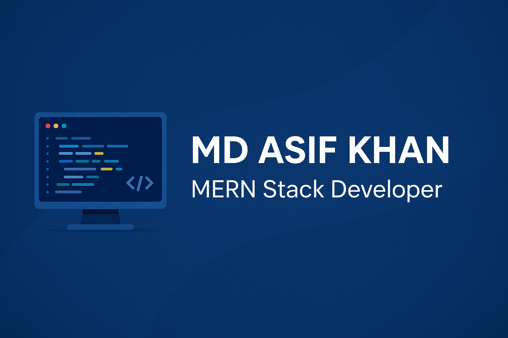

<!-- Banner -->

  

<h1 align="center">Hi, I'm MD Asif Khan 👋</h1>

<h3 align="center">MERN Stack Developer | Software Engineering Student @ UESTC</h3>

---

## 📌 About Me  
Hi! I'm Asif — a passionate **MERN Stack Developer** who loves building clean, modern, and user-friendly web applications.  
I enjoy working with React, exploring backend logic with Node.js, and creating full-stack solutions that make an impact.

### 🔥 What I'm Doing Now
- 🚀 Currently exploring **Node.js & advanced React patterns**  
- 🌍 Working on a **Courier Web App (MERN)**  
- 🔐 Learning more about **Authentication & JWT**  
- 🎨 Improving UI/UX with **Tailwind CSS**  
- 📦 Building reusable components for personal projects  

---

## 🛠️ Skills  

### **Frontend**

  

### **Backend**

  

### **Database**

  

### **Tools & Others**

  

---

## 🌐 Connect With Me  

  
  
  

---

## 📊 GitHub Stats  

  
  

  

